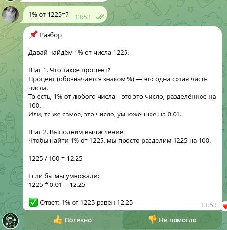
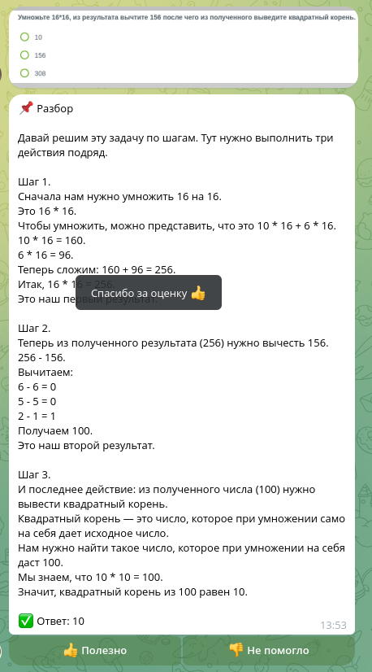
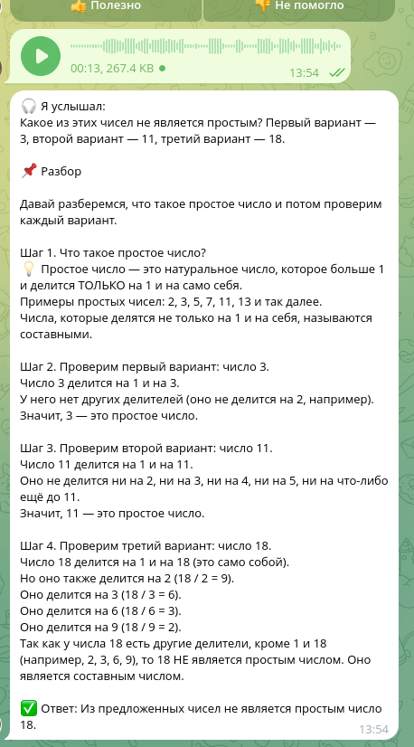
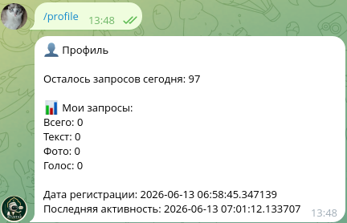
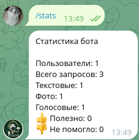
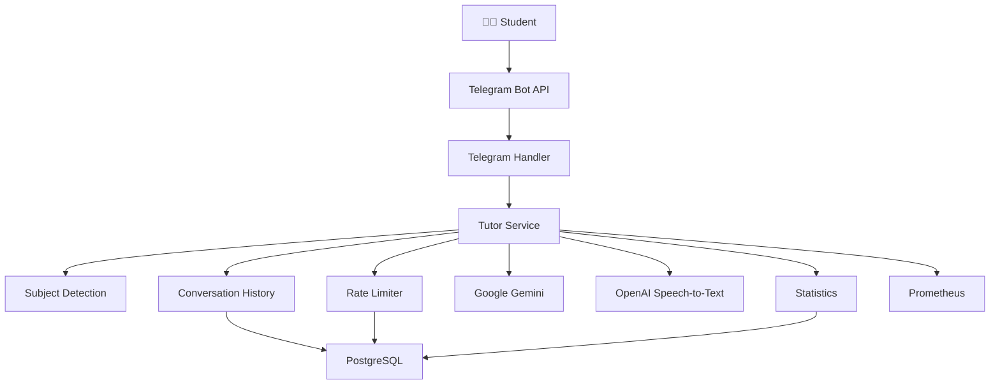

<div align="center">


# 🎓 AI Ustaz

### AI-powered Telegram Tutor built with Go

An intelligent Telegram bot that helps students solve problems from **text**, **images**, and **voice messages** using **Google Gemini** and **OpenAI Speech-to-Text**.

Designed for production deployment with PostgreSQL, Docker, Prometheus, and Railway.


</div>

---

# ✨ Overview

AI Ustaz is a production-ready educational Telegram bot built to help students learn rather than simply receive answers.

The bot supports multiple input formats, automatically detects the subject of a question, maintains conversation context, and provides detailed explanations generated by AI.

Instead of acting like a chatbot, AI Ustaz behaves as a personal tutor capable of explaining mathematics, physics, chemistry, biology, geography, history, English, and other school subjects.

---

# 🚀 Key Features

| Feature               | Description                                         |
| --------------------- | --------------------------------------------------- |
| 🤖 AI Tutor            | Step-by-step explanations powered by Google Gemini  |
| 💬 Text Questions      | Students can ask any question in plain text         |
| 🖼 Image Recognition   | Solves homework from photos and textbook pages      |
| 🎤 Voice Messages      | Speech-to-text with OpenAI transcription            |
| 🧠 Subject Detection   | Automatically identifies the school subject         |
| 💭 Conversation Memory | Supports follow-up questions using previous context |
| 📊 Analytics           | Tracks users, requests, and activity statistics     |
| 👍 Feedback System     | Collects Helpful / Not Helpful ratings              |
| 🔒 Rate Limiting       | Daily request limits per student                    |
| 🛠 Admin Commands      | Built-in monitoring and administration tools        |
| 📈 Monitoring          | Prometheus metrics and Health Check endpoint        |
| 🐳 Production Ready    | PostgreSQL, Docker, Railway deployment              |

---

# 📸 Demo

## 💬 Text Question

Students can send ordinary text questions and receive detailed explanations.



---

## 🖼 Image Question

Homework, textbook pages, handwritten notes, and mathematical problems can be analyzed directly from images.



---

## 🎤 Voice Question

Voice messages are automatically transcribed using OpenAI and then processed by Gemini.



---

## 👤 User Profile

Each student has a profile containing request statistics and daily limits.



---

## 📊 Bot Statistics

Administrators can monitor overall bot usage and feedback.



---

# 🎯 Engineering Highlights

- Production-ready Go backend
- Modular architecture
- AI provider abstraction
- Conversation history
- Subject-aware prompting
- Daily rate limiting
- PostgreSQL persistence
- Structured logging
- Prometheus metrics
- Health checks
- Graceful shutdown
- Docker deployment

---

# 🏗 Architecture



The project follows a modular architecture where each package has a single responsibility.

The Telegram layer is responsible only for communication with Telegram.

Business logic is implemented inside services.

Infrastructure concerns such as AI providers, storage, statistics, metrics, and rate limiting are isolated behind interfaces.

This allows replacing implementations without changing business logic.

---

# 📂 Project Structure

```text
cmd/
├── bot/                # Application entrypoint
└── migrate/            # Database migrations

internal/
├── access/             # User access management
├── ai/                 # Gemini & OpenAI clients
├── app/                # Dependency initialization
├── config/             # Environment configuration
├── db/                 # PostgreSQL connection
├── entity/             # Domain models
├── httpserver/         # Health server
├── limiter/            # Daily request limits
├── metrics/            # Prometheus metrics
├── migrations/         # Embedded SQL migrations
├── service/            # Business logic
├── stats/              # Analytics
├── storage/            # Conversation history
└── telegram/           # Telegram handlers

pkg/
└── logger/

docs/
└── screenshots/

Dockerfile
docker-compose.yml
Makefile
README.md
```

---

# 🛠 Tech Stack

## Backend

- Go
- REST API
- Clean Architecture
- Dependency Injection
- Graceful Shutdown

---

## Artificial Intelligence

- Google Gemini 2.5 Flash
- OpenAI Speech-to-Text
- Prompt Engineering
- Subject-specific prompting

---

## Database

- PostgreSQL
- pgx
- Goose Migrations

---

## Infrastructure

- Docker
- Docker Compose
- Railway

---

## Monitoring

- Prometheus
- Health Check Endpoint
- Structured Logging

---

## Telegram

- go-telegram-bot-api
- Long Polling
- Voice Messages
- Image Processing
- Markdown Responses

---

# ⚡ Core Functionality

## AI Pipeline

```text
Voice
    │
    ▼
OpenAI Transcription
    │
    ▼
Subject Detection
    │
    ▼
Conversation Context
    │
    ▼
Google Gemini
    │
    ▼
Formatted Answer
```

---

## Supported Subjects

- Mathematics
- Physics
- Chemistry
- Biology
- English
- History
- Geography
- General Questions

---

# 🔑 Main Components

| Component     | Responsibility        |
| ------------- | --------------------- |
| Telegram      | User interaction      |
| Tutor Service | Business logic        |
| Gemini Client | AI responses          |
| OpenAI Client | Voice transcription   |
| Storage       | Conversation history  |
| Statistics    | User analytics        |
| Limiter       | Daily request limits  |
| Metrics       | Prometheus monitoring |
| HTTP Server   | Health endpoint       |
| PostgreSQL    | Persistent storage    |

---

# 📊 Production Features

- ✅ PostgreSQL persistence
- ✅ Embedded SQL migrations
- ✅ Conversation memory
- ✅ Subject-aware prompting
- ✅ Request analytics
- ✅ Feedback collection
- ✅ Prometheus metrics
- ✅ Health endpoint
- ✅ Structured logging
- ✅ Docker deployment
- ✅ Railway deployment
- ✅ Graceful shutdown